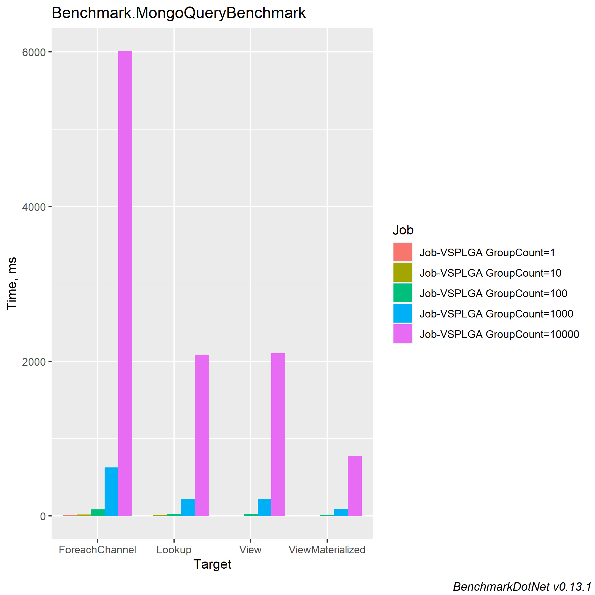
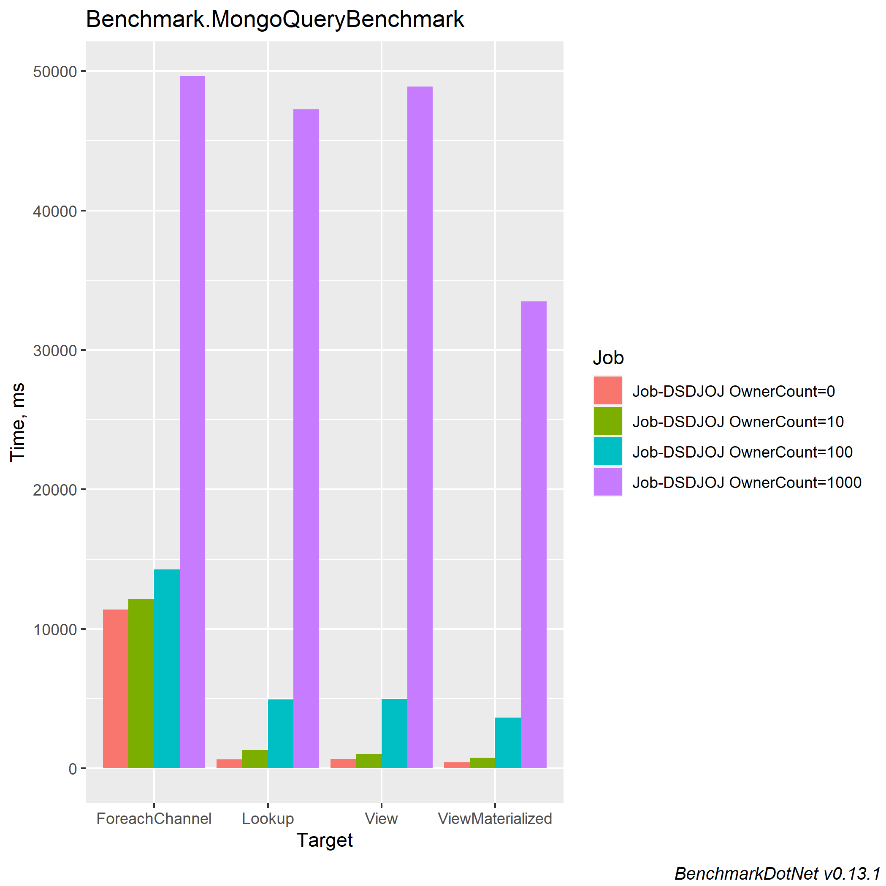

# database-relationship-benchmark


# Benchmark

``` ini

BenchmarkDotNet=v0.13.1, OS=Windows 10.0.19043.1415 (21H1/May2021Update)
Intel Core i5-8400 CPU 2.80GHz (Coffee Lake), 1 CPU, 6 logical and 6 physical cores
.NET SDK=6.0.100
  [Host]     : .NET 6.0.0 (6.0.21.52210), X64 RyuJIT
  Job-VSPLGA : .NET 6.0.0 (6.0.21.52210), X64 RyuJIT

IterationCount=5  LaunchCount=1  RunStrategy=ColdStart  
UnrollFactor=1  WarmupCount=1  
```


## Scenario 1: Groups impact

This benchmark test the impact of increasing groups count. Based 95e percentile real life data, each group will have 5 owners and 10 links.

### On local MongoDB:


|           Method | GroupCount |         Mean |      Error |     StdDev |       Median |
|----------------- |----------- |-------------:|-----------:|-----------:|-------------:|
|   **ForeachChannel** |          **1** |    **16.570 ms** | **102.557 ms** |  **26.634 ms** |     **4.812 ms** |
|           Lookup |          1 |     6.027 ms |  23.702 ms |   6.155 ms |     3.168 ms |
|             View |          1 |     4.595 ms |  19.114 ms |   4.964 ms |     2.521 ms |
| ViewMaterialized |          1 |     3.988 ms |  18.482 ms |   4.800 ms |     1.917 ms |
|   **ForeachChannel** |         **10** |    **19.510 ms** |  **69.655 ms** |  **18.089 ms** |    **11.249 ms** |
|           Lookup |         10 |     7.331 ms |  24.499 ms |   6.362 ms |     4.679 ms |
|             View |         10 |     6.505 ms |  18.459 ms |   4.794 ms |     4.297 ms |
| ViewMaterialized |         10 |     4.679 ms |  17.354 ms |   4.507 ms |     2.895 ms |
|   **ForeachChannel** |        **100** |    **87.252 ms** |  **87.657 ms** |  **22.764 ms** |    **74.040 ms** |
|           Lookup |        100 |    29.169 ms |  21.199 ms |   5.505 ms |    27.438 ms |
|             View |        100 |    28.317 ms |  18.867 ms |   4.900 ms |    26.317 ms |
| ViewMaterialized |        100 |    14.026 ms |  16.887 ms |   4.385 ms |    11.985 ms |
|   **ForeachChannel** |       **1000** |   **626.763 ms** | **245.540 ms** |  **63.766 ms** |   **602.468 ms** |
|           Lookup |       1000 |   220.476 ms |  94.385 ms |  24.511 ms |   211.045 ms |
|             View |       1000 |   222.942 ms |  95.892 ms |  24.903 ms |   211.243 ms |
| ViewMaterialized |       1000 |    94.685 ms |  84.316 ms |  21.897 ms |    85.464 ms |
|   **ForeachChannel** |      **10000** | **6,011.406 ms** | **808.450 ms** | **209.952 ms** | **5,991.281 ms** |
|           Lookup |      10000 | 2,088.304 ms |  60.753 ms |  15.777 ms | 2,078.209 ms |
|             View |      10000 | 2,104.564 ms |  83.106 ms |  21.582 ms | 2,100.735 ms |
| ViewMaterialized |      10000 |   773.655 ms | 231.306 ms |  60.069 ms |   740.742 ms |



**Observations**
* It seems the cost of query increase linearly O(N)
* Lookup and View have as expected the same performance (since under the hood they use the same aggregation pipeline)
* The ForeachChannel is worse by a factor of x3


### On hosted MongoDB

|           Method | GroupCount |          Mean |        Error |       StdDev |        Median |
|----------------- |----------- |--------------:|-------------:|-------------:|--------------:|
|   **ForeachChannel** |          **1** |      **84.03 ms** |    **136.82 ms** |    **35.532 ms** |      **68.36 ms** |
|           Lookup |          1 |      27.94 ms |     36.42 ms |     9.458 ms |      23.99 ms |
|             View |          1 |      30.57 ms |     29.54 ms |     7.671 ms |      28.84 ms |
| ViewMaterialized |          1 |      24.99 ms |     13.19 ms |     3.425 ms |      23.67 ms |
|   **ForeachChannel** |         **10** |     **238.81 ms** |    **530.54 ms** |   **137.781 ms** |     **170.89 ms** |
|           Lookup |         10 |      46.67 ms |     42.72 ms |    11.095 ms |      47.02 ms |
|             View |         10 |      32.34 ms |     20.73 ms |     5.384 ms |      30.30 ms |
| ViewMaterialized |         10 |      31.80 ms |     26.16 ms |     6.793 ms |      30.18 ms |
|   **ForeachChannel** |        **100** |   **1,306.22 ms** |    **464.76 ms** |   **120.698 ms** |   **1,259.62 ms** |
|           Lookup |        100 |     114.31 ms |     36.01 ms |     9.351 ms |     110.16 ms |
|             View |        100 |     135.33 ms |    186.39 ms |    48.404 ms |     114.70 ms |
| ViewMaterialized |        100 |      86.50 ms |     87.29 ms |    22.669 ms |      74.83 ms |
|   **ForeachChannel** |       **1000** |  **12,156.97 ms** |  **1,255.32 ms** |   **326.003 ms** |  **12,117.13 ms** |
|           Lookup |       1000 |     873.15 ms |    161.75 ms |    42.006 ms |     849.55 ms |
|             View |       1000 |     898.86 ms |    219.11 ms |    56.903 ms |     877.90 ms |
| ViewMaterialized |       1000 |     599.24 ms |    148.75 ms |    38.630 ms |     597.46 ms |
|   **ForeachChannel** |      **10000** | **122,958.47 ms** | **28,351.29 ms** | **7,362.740 ms** | **121,110.28 ms** |
|           Lookup |      10000 |   8,605.77 ms |  1,258.44 ms |   326.814 ms |   8,754.91 ms |
|             View |      10000 |   9,288.47 ms |  6,773.26 ms | 1,758.994 ms |   8,452.14 ms |
| ViewMaterialized |      10000 |   5,482.61 ms |    807.17 ms |   209.620 ms |   5,449.45 ms |


**Observations**

* With the hosted database their is now latency, which considerably impact the ForeachChannel since it's doing client-side requests O(N)


## Scenario 2: Owners impact (reference)

This benchmark tests the impact of increasing owners count, which required a lookup with the reference pattern. (1000 groups, 10 links)

### On hosted MongoDB

|           Method | OwnerCount |        Mean |        Error |      StdDev |
|----------------- |----------- |------------:|-------------:|------------:|
|   **ForeachChannel** |          **0** | **11,387.6 ms** |    **513.76 ms** |   **133.42 ms** |
|           Lookup |          0 |    631.3 ms |    134.20 ms |    34.85 ms |
|             View |          0 |    673.5 ms |    390.14 ms |   101.32 ms |
| ViewMaterialized |          0 |    435.8 ms |     73.48 ms |    19.08 ms |
|   **ForeachChannel** |         **10** | **12,157.3 ms** |  **3,554.97 ms** |   **923.21 ms** |
|           Lookup |         10 |  1,308.7 ms |    338.76 ms |    87.97 ms |
|             View |         10 |  1,042.2 ms |    143.94 ms |    37.38 ms |
| ViewMaterialized |         10 |    771.9 ms |    469.49 ms |   121.93 ms |
|   **ForeachChannel** |        **100** | **14,270.1 ms** |  **3,416.82 ms** |   **887.34 ms** |
|           Lookup |        100 |  4,946.0 ms |  2,329.62 ms |   604.99 ms |
|             View |        100 |  4,959.4 ms |  1,854.19 ms |   481.53 ms |
| ViewMaterialized |        100 |  3,636.7 ms |  1,507.19 ms |   391.41 ms |
|   **ForeachChannel** |       **1000** | **49,637.7 ms** |  **7,767.47 ms** | **2,017.19 ms** |
|           Lookup |       1000 | 47,242.4 ms |  4,189.04 ms | 1,087.88 ms |
|             View |       1000 | 48,897.0 ms | 11,593.01 ms | 3,010.67 ms |
| ViewMaterialized |       1000 | 33,477.4 ms |  4,724.97 ms | 1,227.06 ms |



## Scenario 3: Links impact (parent - reference)

This benchmark tests the impact of increasing links count, which required a lookup with the parent-reference pattern. (1000 groups, 10 owners)


### On hosted MongoDB

### Resource

MongoDb doc: https://chsakell.gitbook.io/mongodb-csharp-docs/getting-started/quick-start/collections
Benchmark dotnet graph: https://makolyte.com/comparing-performance-with-benchmarkdotnet-graphs/ 